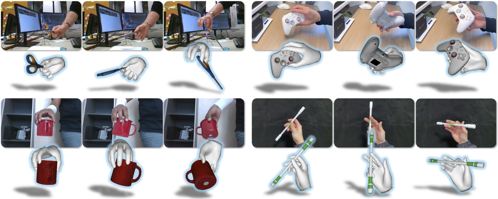

<div align="center">

# AGILE

### Hand-Object Interaction Reconstruction from Video via Agentic Generation

<p>
  <a href="https://agile-hoi.github.io"></a>
  <a href="https://arxiv.org/abs/2602.04672"></a>
  <a href="https://arxiv.org/pdf/2602.04672"></a>
</p>

[Jin-Chuan Shi](https://chuan-10.github.io/)<sup>1\*</sup>, Binhong Ye<sup>1\*</sup>, Tao Liu<sup>1</sup>, Xiaoyang Liu<sup>1</sup>, Yangjinhui Xu<sup>1</sup>, Junzhe He<sup>1</sup>, Zeju Li<sup>1</sup>, [Hao Chen](https://stan-haochen.github.io/)<sup>1</sup>, [Chunhua Shen](https://cshen.github.io/)<sup>1,2</sup>

<sup>1</sup>State Key Lab of CAD & CG, Zhejiang University &nbsp; <sup>2</sup>Zhejiang University of Technology

<sup>\*</sup>Equal contribution

**ACM SIGGRAPH 2026, Conference Track**



</div>

## News

- **[2026.03]** AGILE is conditionally accepted to **ACM SIGGRAPH 2026** (Conference Track)!
- **[2026.03]** Project page and paper released.
- **[Coming Soon]** Code will be released incrementally, with the full codebase available by June 2026. Stay tuned!

## Abstract

Reconstructing dynamic hand-object interactions from monocular videos is critical for dexterous manipulation data collection and creating realistic digital twins for robotics and VR. However, current methods face two prohibitive barriers: (1) reliance on neural rendering often yields fragmented, non-simulation-ready geometries under heavy occlusion, and (2) dependence on brittle Structure-from-Motion (SfM) initialization leads to frequent failures on in-the-wild footage.

We introduce **AGILE**, a robust framework that shifts the paradigm from *reconstruction* to *agentic generation* for interaction learning. Our method employs an agentic pipeline where a Vision-Language Model (VLM) guides a generative model to synthesize complete, watertight object meshes with high-fidelity textures, independent of video occlusions. Bypassing fragile SfM entirely, we propose a robust *anchor-and-track* strategy that initializes the object pose at a single interaction onset frame and propagates it temporally. A contact-aware optimization integrates semantic, geometric, and interaction stability constraints to enforce physical plausibility.

Extensive experiments on HO3D, DexYCB, and in-the-wild videos show that AGILE outperforms baselines in global geometric accuracy while demonstrating exceptional robustness on challenging sequences where prior methods frequently collapse.

## Citation

If you find this work useful, please consider citing:

```bibtex
@article{shi2026agile,
  title={AGILE: Hand-Object Interaction Reconstruction from Video via Agentic Generation},
  author={Shi, Jin-Chuan and Ye, Binhong and Liu, Tao and Liu, Xiaoyang and Xu, Yangjinhui and He, Junzhe and Li, Zeju and Chen, Hao and Shen, Chunhua},
  journal={arXiv preprint arXiv:2602.04672},
  year={2026}
}
```

## Acknowledgements

We thank the authors of [HOLD](https://github.com/zc-alexfan/hold), [MagicHOI](https://github.com/MagicHOI/MagicHOI), [WiLoR](https://github.com/rolpotamern/WiLoR), [FoundationPose](https://github.com/NVlabs/FoundationPose), [MoGe](https://github.com/microsoft/MoGe), [MegaSAM](https://github.com/mega-sam/mega-sam), and [Viser](https://github.com/nerfstudio-project/viser) for their excellent work.
